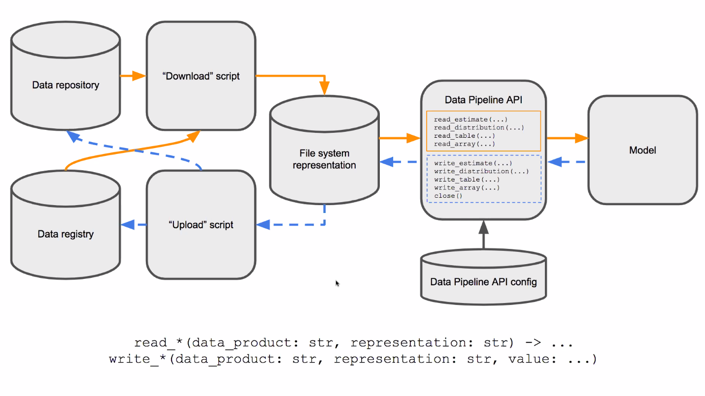

# C++ data management library for Covid19 RAMP

Licensed under BSD 3-clause, 
as all other https://github.com/ScottishCovidResponse project. 
Copyright ScottishCovidResponseConsortium 2020

Except for files under "third-party", "code_generator" folders

This repo is not a completed project yet, esp. python code_generator, which was developed by Qingfeng Xia's weekend/non-office hours.  The `code_generator` will be developed in the author's personal github to be some kind of usefulness.

**IMPORTANT NOTICE**
The latest C++ Pipeline API will be based on pybind11 wrapping of Python Pipeline API.
https://github.com/ScottishCovidResponse/data_pipeline_api/tree/cppbinding-dev/bindings/cpp

Work on this repo as a trial of pure C++ implementation will stop for the moment. Some of the files will be merged to https://github.com/ScottishCovidResponse/data_pipeline_api/tree/cppbindings/bindings/cpp

In this repo, currently, it has a python code generator and HDF5IO.h to save c++ data class into HDF5 file without using/knowing HDF5 API, some other model input and result types definition. 

June 26 2020

## Introduction RAMP

### Data pipeline

Unified data management and workflow

Model cross-validation PPT:  UoGlasgow Team shared files

Zulip link:  https://zulip.scrc.uk/#narrow/stream/14-Data/topic/Questions.20about.20the.20new.20data.20system

@Richard Reeve: who is PM for data management
@Ian Hinder: who is lead RSE for the other C++ project, 
@Chris Hughes: who has been working out a lot of the requirement/design details

more doc in university glasgow Team "Files"

### API design

https://github.com/ScottishCovidResponse/SCRC-internal/wiki/Model-data-pipeline-interaction

Python API
https://github.com/ScottishCovidResponse/data_pipeline_api/tree/master/data_pipeline_api

R data API
https://github.com/ScottishCovidResponse/SCRCdataAPI

### Data store/registry: http://data.scrc.uk/

Data registry: database schema
https://github.com/ScottishCovidResponse/data-registry

meta data definition diagram
https://dbdiagram.io/d/5ebbb29439d18f5553ff207e

 @Richard Blackwell is working on putting simple_network_sim files in there at the moment
DataObjects:
Data Store  
Source
Source Version
Data Product
Processing Script
Processing Script Version
Data Product Version
Data Product Version Component
Model
Model Version
Model Run

### Projects/models use C++ Data Pipeline API
+ EERAModel
+ covid-sim
+ CoronaBICI 

### Ian's Cpp binding of Python Pipeline API

As the repo has not impl model input DataPipeline API, currently or perhaps model input should use Ian/s binding
https://github.com/ScottishCovidResponse/data_pipeline_api/tree/cppbindings/bindings/cpp

One point to discuss is, what should be the type returned from `read_table()` that can be shared widely? 

Ian made his own `Table` class,  There is third-party full-featured CSV single header library. 

#### use HDF5IO.h with Ian's DataPipeline.h
The not-implemented DataPipeline.h has be removed from from this repo, so this repo can work together with Ian's cppbinding.

The currently **workflow** for HDF5 IO (manual workflow)
+ copy all classes to written into HDF5,  e.g.  `particle` or later more general result c++ class type, into a header file `EERA_types.h`, as input to the `hdf5_generator.py`

+ `hdf5_generator.py` is a python code generator, aiming to generate H5:CompType instance for almost any C++ class
 see more in <code_generator/Readme.md>

+ `HDF5IO.h`  read and write any class with the generated H5:CompType instance in the generated `*_types_hdf5.h`

`HDF5IO.h` is a head-only lib, just put `include/` and `third-party/` of this repo as `include_directories()` in specific model project cmake, it should work. 

The workflow can be automated by cmake.

### Plan for C++ API

1. component selection, cmake setup, and test locally
> done

2. develop pipeline API (yet done)
  done (HDF5IO.h)

  todo: (or just use Ian's c++ wrapping of python API)
  Pipeline API `write_*()`
  Distribution class: just use `boost::random` ?
  Parameter class
  unit test: 

3. integrate with EERA model,  

  using macro to switch between current local csv files IO, and pipeline IO

4. result writing into HDF5 file
 > HDF5IO is nearly done

  define h5 data types, see example `EERA_types_hdf5.h`
  using python script "hdf5_generator.py" to generate/update `EERA_types_hdf5.h`

 Image can be pushed into HDF5, but log file may be treated as string
 Parameter are treated as HDF5::Table, or just as toml file
 Log can be store a string attribute

post-processing should not be part of C++ pipeline. 
Post-processing can be done in another language like R or python

5. result push to data registry and model cross-validation: 
  the key task is the data structure definition for parameter and result

## Third-party library selection

+ HDF5: for simulation result packing

Model input format will be yaml, json or toml will not be used
+ yaml: 

Since download and upload is not part of data pipeline, networking RESTFUL C++ will be removed
+ poco for networking: the only lib I have used, 
  other: restfulcpp, etc 
  header only: https://github.com/yhirose/cpp-httplib
+ json.hpp header only C++ json: extensible to decode/encode user types
+ toml11: header only lib: https://github.com/ToruNiina/toml11#converting-a-table

+ csv: header only https://github.com/vincentlaucsb/csv-parser#single-header

A more advanced C++ lib for data table as in R Table or Pandas.DataFrame
+ [xframe, towards a C++ dataframe](https://medium.com/@johan.mabille/xframe-towards-a-c-dataframe-26e1ccde211b)
+ <https://github.com/hosseinmoein/DataFrame>

### HDF5 C++ libraries

1. Official C++ aPI
   	There are official C API and C++ wrapper `H5CPP`. 
   	**H5CPP is now MPI capable given c++17 capable MPI compiler**

	HDF5 v1.8 has significantly difference with HDF5 v1.10
   	https://support.hdfgroup.org/HDF5/doc/ADGuide/Changes.html

	For Eigen::Matrix support
	https://github.com/garrison/eigen3-hdf5  does not work with HDF5 1.10
	https://github.com/Gjacquenot/eigen3-hdf5 works with HDF5 1.10

2. HighFive
	https://github.com/BlueBrain/HighFive
	Header-only, with `T[][], boost::ublas, Eigen::Matrix, XTensor` support

### HDF5 file viewer on Ubuntu 18.04/20.04

Ubuntu 18.04 's **hdfview** from official repository has bug, it can not view the data.

`pip install h5pyViewer`  but it is python2 only, not updated since 2015.

On ubuntu 18.04 `pip3 install vitables` also have some problem, pip3 can not install PyQt5,  even  after PyQt5 has been installed from system package manager,  pip3 seems does not find it,  so I download vitables.3.0.2 source code,  comment out 2 lines in `setup.py` and install it.  On ubuntu 18.04, `vitables` can be installed by `apt-get`

Command line tool `h5dump` is working to check h5 data structure.

## Installation

This is C++ API is designed to be header-only, while dependency libraries need to be installed, see guide below. This API can be used  as a git submodule, or just copy this repo folder into specific model project, and then include this folder in the project root CMakeLists.txt.
Or git clone this repo as the sibling folder of model repo, e.g. `EERAModel`, it is just header include directionary to be sorted out in CMake

note: as git module is used, add `--recursive`when clone this repo, i.e. `git clone --recursive this_repo`. read more on using submodule: <https://www.vogella.com/tutorials/GitSubmodules/article.html>

### Code structure

Generic API
+ DataPipeline.h: the generic API for all C++ models
+ Restful.h: get json or other config file by URL
+ HDF5IO.h:  helper functions to ease HDF5 IO

+ code_generator/ : an independent python code generation script
+ demo/ :  demo the usage of code generator for hdf5 IO
+ EERA_pipeline_demo/ :   EERA model specific header and demo
+ tests/ : unit tests

Some header only libraries are downloaded and copied into this repository for the moment.  `git submodule add -b master https://github.com/ToruNiina/toml11.git`
+ json.hpp   download as a copy
+ toml.hpp    git submodule 
+ csv.hpp  download as a copy
+ eigen3-hdf5.hpp  download as a copy, with modification

### Install dependency on Ubuntu 18.04/20.04

`sudo apt install libssl-dev, libpoco-dev, libhdf5-dev`
optional: 
`sudo apt install libeigen3-dev`

### RHEL/Centos 7
Centos versions are older than Ubuntu, sometimes versions cause trouble.
poco-devel-1.6.1-3.el7.x86_64.rpm
hdf5-devel-1.8.12-11.el7.x86_64.rpm
`yum install epel-release -y && yum install poco-devel openssl-devel cmake3 hdf5-devel -y`

optional: `yum install install eigen3-devel`

This project's cmake can download and build latest HDF5 lib in local build folder. 

#### MacOS 
homebrew maybe is the way to go. The dependencies name and version can be checked online
https://formulae.brew.sh/formula/

If brew is not installed yet, run `/bin/bash -c "$(curl -fsSL https://raw.githubusercontent.com/Homebrew/install/master/install.sh)"`

Install dependencies: `brew update && brew install eigen poco hdf5 openssl`

On macos-latest (?), the default HDF5 version is 1.12. It is possible to install `hdf5@1.10`, but cmake failed to find it, version 1.12 is used.

cmake could not find OpenSSL installation, however, networking code has been turn off, will be removed later.

###  build with cmake

Only 2 demo cpp to test out platform cmake configuration. 

## Data pipeline flow 

To get started, I would expected all EERA model input parameter will come in  file format (restful get / local hdf5), adapted for EERA model if needed.   

HDF5 write is for result, as HDF5 is good for large dataset in IO performance.

### model data flow
-> download json parameters/dataset (by restful GET API) from central store
 this will be not part of C++ data pipeline API, it could be python.

-> parse parameters into model-specific config file (for the time being)/C++ data structure as model input (later) 
-> prepare dataset into model-specific input file (for the time being)/C++ data structure as model input (later)  

-> model-specific simulation to generate log and result files
-> model-specific post-processing into images, report files

-> packed all into one HDF5 file
-> upload to central store

It is assume model needs 2 kinds of inputs
+ small textual config file to tweak model behavior
+ large dataset files

Model author will focus on model simulation code and judge the quality of result

## EERA specific
### [EERAModel_Data.md](EERAModel_Data.md)

